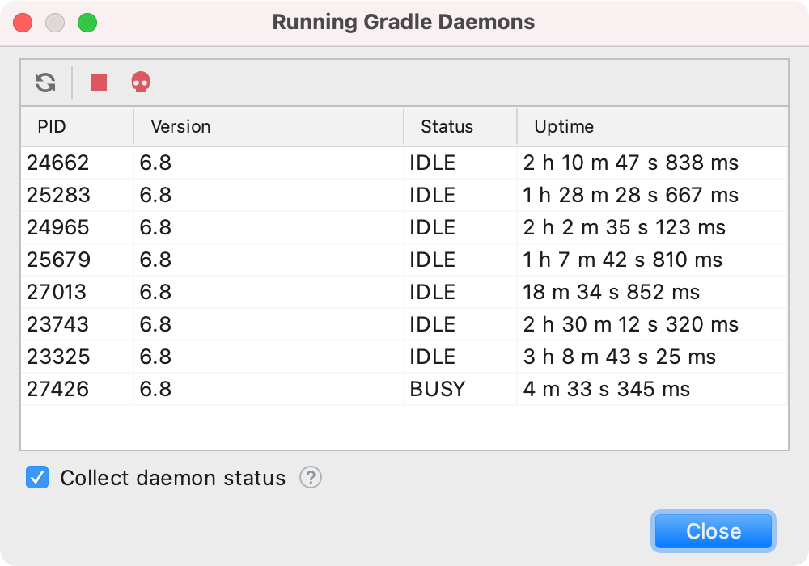

# IntelliJ Gradle Utilities Plugin

This IntelliJ plugin provides some useful utilities to support the daily work with Gradle. 

[**It's available on the official IntelliJ plugin marketplace**](https://plugins.jetbrains.com/plugin/16800-gradle-utilities).

(This plugin has no relation to the official Gradle project.)

## Utilities Actions

The utilities are available in the toolbar of the Gradle tool window (select *View | Tool Windows | Gradle*) under the *Gradle Utilities* action popup button:

### Manage Running Gradle Daemons

Lists all running Gradle daemons with their status. Additionally, actions to terminate daemons or viewing their command lines are available.

### Manage Gradle Home

#### Clear Gradle Caches

Clears all Gradle caches. This includes all downloaded dependencies and Gradle daemon caches.

#### Manage Gradle Wrapper Distributions

Lists all downloaded Gradle wrapper distributions and their sizes on the disk and offers an action to delete them.

#### Manage Gradle Daemons Caches

Lists all Gradle daemon caches and their sizes on the disk and offers an action to delete them.

### Collect Gradle Environment Information

Collects information about the current Gradle environment, like relevant paths, versions, user/project Gradle properties, and environment variables.

### Verification

Verifies the integrity of the downloaded Gradle Wrapper JAR and distributions by comparing their checksums with the official ones.

### Find the Latest Gradle Releases

Finds the latest Gradle releases (productive and pre releases) and provides useful links, like the release notes.

### Other

* Edit the user Gradle properties file.
* Bookmarks to important Gradle related websites.

## Development

This plugin is not seen as a library, this means that code changes do not necessarily adhere to the semantics version rules.

If you want to contribute something, please follow the code style in the `.editorconfig` and sign your commits.
