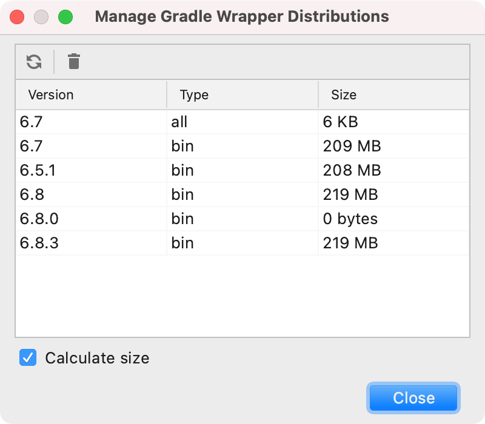
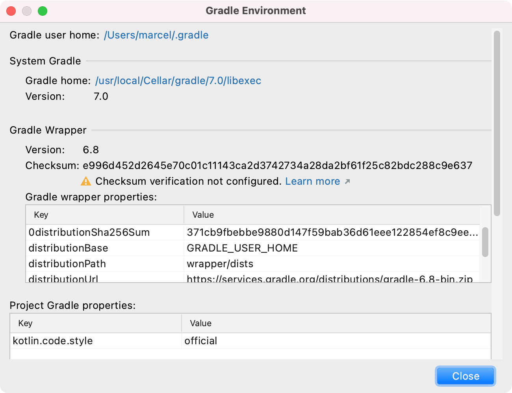

# IntelliJ Gradle Utilities Plugin

This IntelliJ plugin provides some useful utilities to support the daily work with Gradle. [**It's available on the official IntelliJ plugin marketplace**](https://plugins.jetbrains.com/plugin/16800-gradle-utilities).

(This plugin has no relation to the official Gradle project.)

## Utilities

The utilities are available in the toolbar of the Gradle tool window (select *View | Tool Windows | Gradle*) under the *Gradle Utilities* action popup button:

### Manage Running Gradle Daemons

Lists all running Gradle daemons with their status. The daemons can easily be terminated, or their command line can be viewed.

### Manage Gradle Home

#### Clear Gradle Caches

Clears the whole Gradle caches. This includes all downloaded dependencies and Gradle daemon caches.

#### Manage Gradle Wrapper Distributions

Lists all downloaded Gradle wrapper distributions and their sizes on the disk, which can be easily deleted.

#### Manage Gradle Daemons Caches

Lists all Gradle daemon caches and their sizes on the disk, which can be easily deleted.

### Collect Gradle Environment Information

Collects information about the current Gradle environment, like relevant paths, versions, user/project Gradle properties and environment variables.

### Find the Latest Gradle Releases

Finds the latest Gradle releases (productive and pre releases) and provides useful links, like the release notes.

### Other

* Edit user Gradle properties
* Bookmarks to important Gradle related websites

## Development

This plugin is not seen as a library, this means that code changes do not necessarily adhere to the semantics version rules.

If you want to contribute something, please follow the code style in the `.editorconfig` and sign your commits.

## Planned Features

- Make texts translatable.

## License

Copyright (c) 2021 Marcel Kliemannel

Licensed under the **Apache License, Version 2.0** (the "License"); you may not use this file except in compliance with the License.

You may obtain a copy of the License at <https://www.apache.org/licenses/LICENSE-2.0>.

Unless required by applicable law or agreed to in writing, software distributed under the License is distributed on an "AS IS" BASIS, WITHOUT WARRANTIES OR CONDITIONS OF ANY KIND, either express or implied. See the [LICENSE](./LICENSE) for the specific language governing permissions and limitations under the License.
